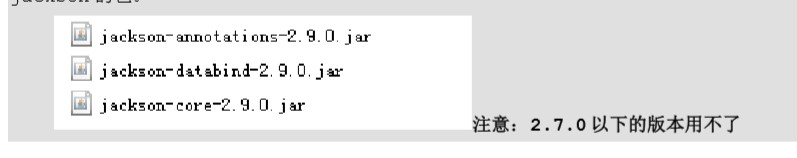

# v4.6 响应json数据之 响应json格式数据：

***需求：***

使用@ResponseBody注解实现将controller方法返回对象转换为json响应给客户端

***前置知识：***
 springMVC默认用MappingJacksonHttpMessageConverter对json数据进行转换，需要加入jackson的包：
 
 

1. 在pom.xml文件中引入jar包