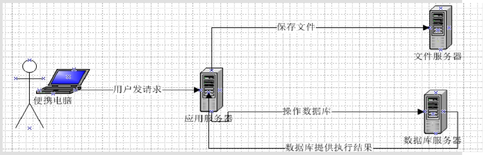
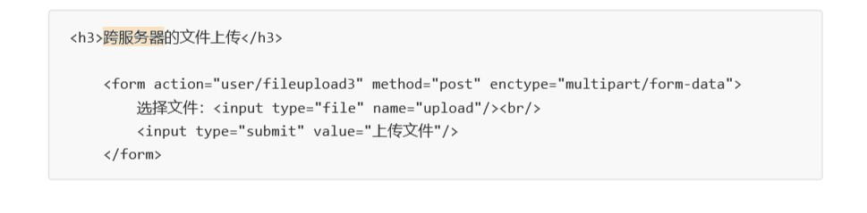
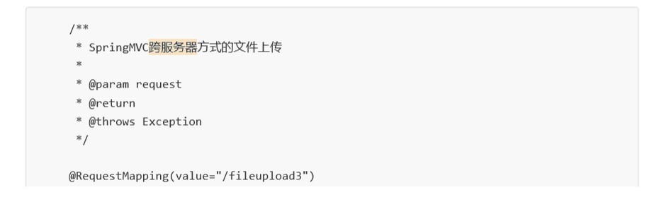
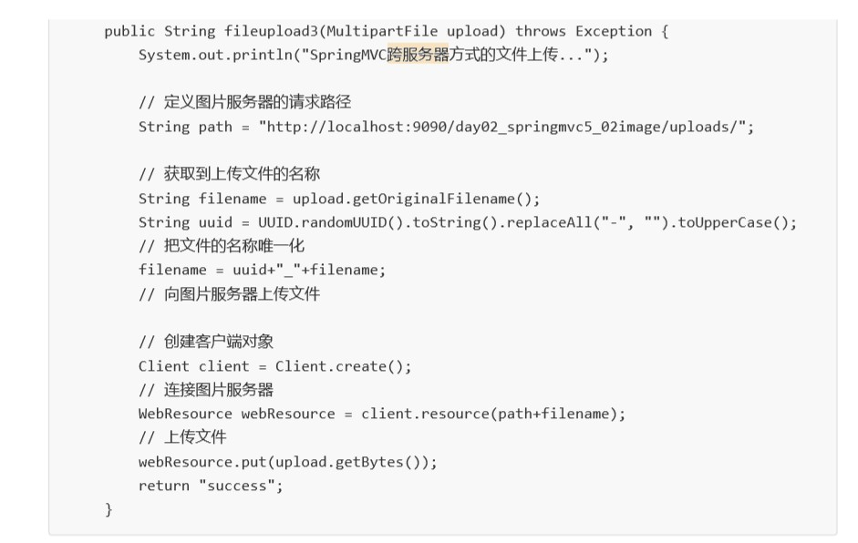

SpringMVC实现文件上传

# v5.2 springMVC跨服务器方式的文件上传


##  1.分服务器的目的：

```java
    在实际开发中，我们会有很多处理不同功能的服务器。例如：
        应用服务器：负责部署我们的应用
        数据库服务器：运行我们的数据库
        缓存和孝洗服务器：负责处理大并发访问的缓存和消息
        文件服务器：负责存储用户上传文件的服务器。
   （注意：此处说的不是服务器集群）
```


分服务器处理的目的是让服务器各司其职，从而提高我们项目的运行效率




## 2. 步骤：


### 1. 搭建图片服务器：
        
        1. 根据文档配置tomcat9 的服务器，现在是2个服务器
        2. 导入资料中day02_springmvc5_02image项目，作为图片服务器使用
        
        
### 2. 实现springmvc跨服务器方式文件上传：


1. 导入开发需要的jar包
    
    
 ```java
 <dependency>
      <groupId>com.sun.jerse</groupId>
      <artifactId>jersey-cor</artifactId>
      <version>1.18.1</version>
    </dependency>
    <dependency>
      <groupId>com.sun.jerse</groupId>
      <artifactId>jersey-clien</artifactId>
      <version>1.18.1</version>
    </dependency>
```


2. 编写文件上传的jsp页面
    



3. 写控制器：


