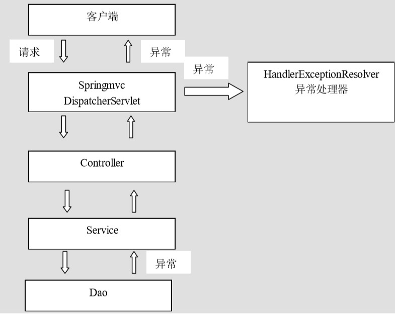

# v6.0  springMVC的异常处理 - 分析和环境搭建：

## 1. 异常处理思路 ：

系统中异常包括两类：预期异常和运行时异常 RuntimeException，前者通过捕获异常从而获取异常信息， 后者主要通过规范代码开发、测试通过手段减少运行时异常的发生。
 
 系统的 dao、service、controller 出现都通过 throws Exception 向上抛出，最后由 springmvc 前端 控制器交由异常处理器进行异常处理，如下图:
 

## 2. springMVC的异常处理：

### 1. 自定义异常类：

### 2. 自定义异常处理器：

### 3.  配置异常处理器：

